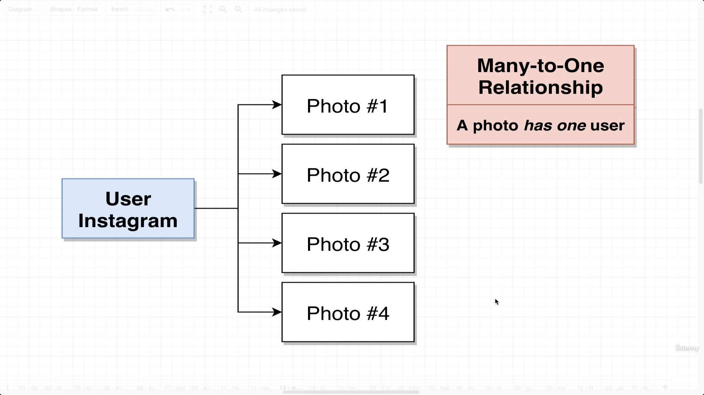
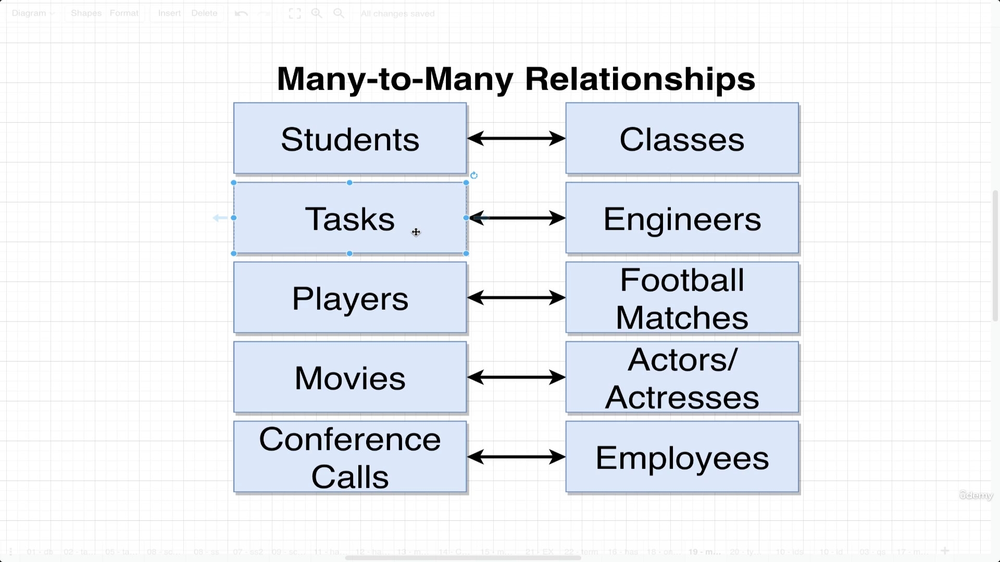
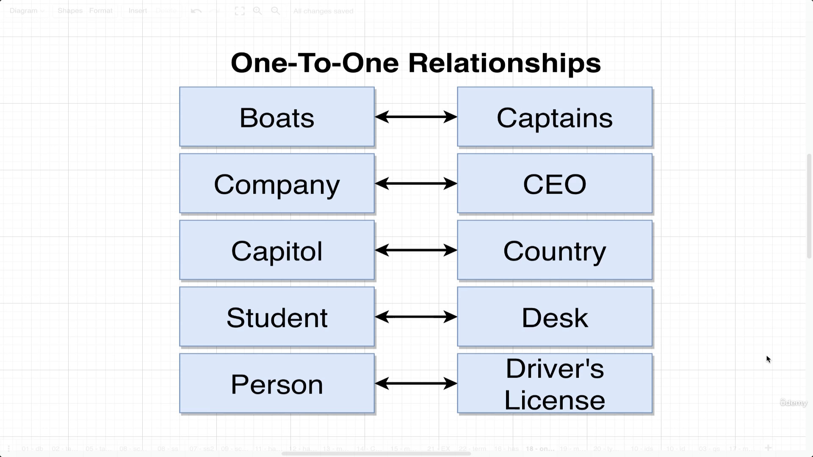
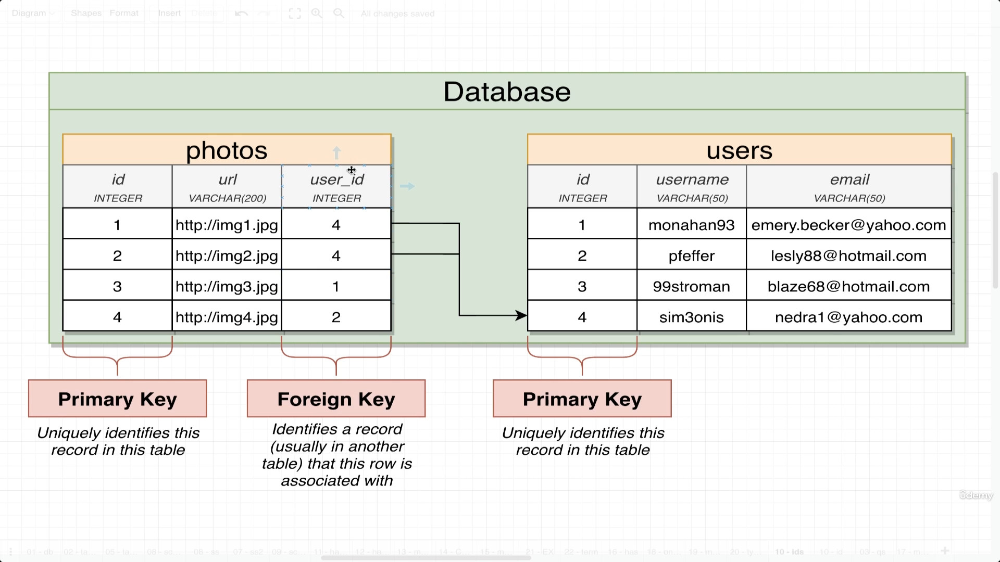

 # Four types of relationship

 1. Many-to-one
   
 2. One-to-many
 

 *NOTE:* Many-to-one and One-to-many just depends on the perspective of viewing the relation

 3. Many-to-many
 
 - Each student can have many classes and each class can have many student
 4. One-to-one
   
   
- Each capital can be of one country at a time and each country can have only one capital at a time
  
  

# Implementing realtions using ***Primary and Foreign key***

- The Primary key is an unique id
- Lets suppose we have a instagram user with different photos and the tables are implemented in the above way
- The Foreign key can be used in the `Photos` table to make a connection with `Users` table, the `Users` table will have those ids as primary keys within their table, so a foreign key and a primary key will make a relationship between two tables
- Again, relation of One-to-many and Many-to-one here depends on which side we consider as our perspective
