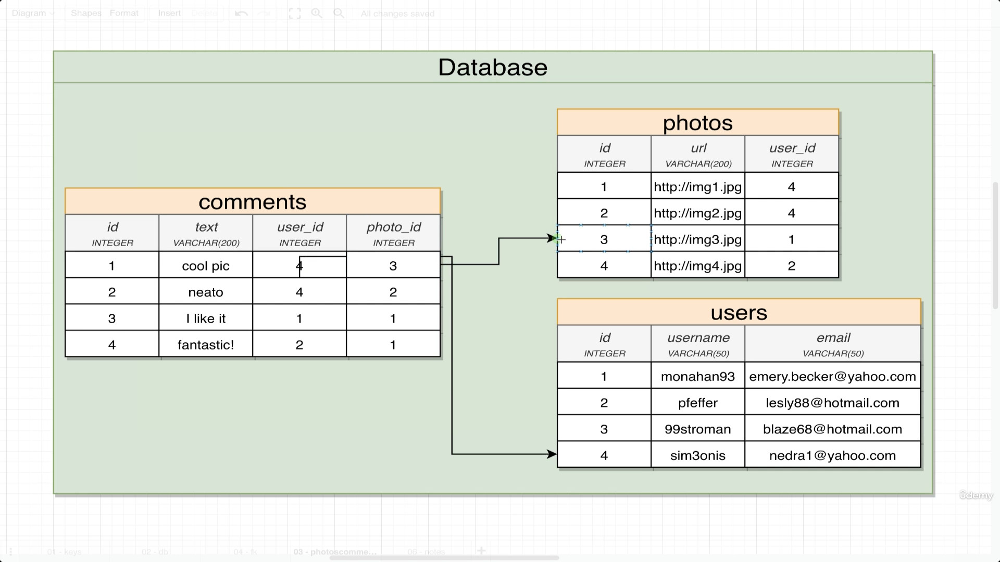

# Demonstrating the table which depends on more than one table

Each user will have photos, and each photo will have comments associated to particular users, the table design is show below-

> eg. the first column represents, the comment of the user having the id 4 and the photo, having the id 3

> NOTE: as Users table doesn't have has-many side to any table, it doesn't have foreign key

