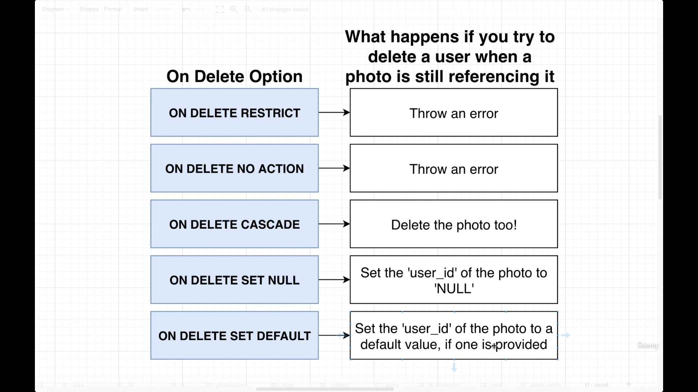

# Delete Constraints on Foreign key column to ensure data consistency

PostgreSql have these Delete constraints available


> eg.
> ```sql
>CREATE TABLE photos (
>    id SERIAL PRIMARY KEY,
>    url VARCHAR(200),
>user_id INTEGER REFERENCES users(id) ON DELETE CASCADE
>); 
> ```
> - this will ensure that whenever a user with certain id is deleted, the associated row (linked with foreign key)of the related table, will also gets deleted
